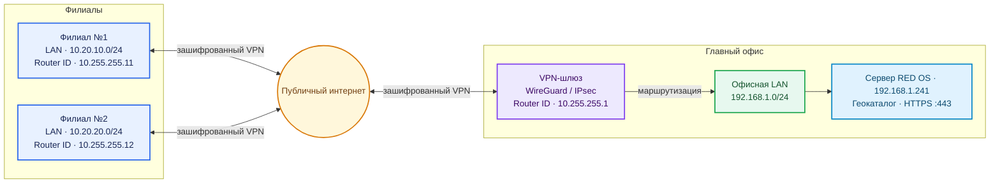
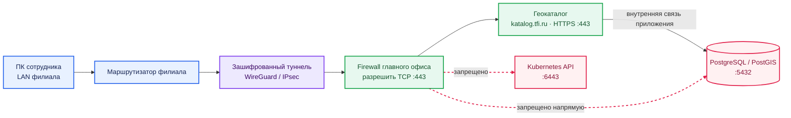

# Связь филиалов с главным офисом: VPN и маршрутизация

Практическое руководство для подключения нескольких площадок к каталогу на сервере `zabbix`.
Это проектная схема и план работ, а не готовая команда для вставки в работающий маршрутизатор.
Перед изменением сети нужно сверить модели роутеров, версии прошивок, реальные LAN-подсети и текущую конфигурацию VPN.

## Коротко: что строим

- Между площадками через публичный интернет поднимается **зашифрованный site-to-site VPN**.
- Маршруты между локальными сетями идут **через VPN**, а не открываются всему интернету.
- Для пары филиалов достаточно статических маршрутов. OSPF имеет смысл, когда маршрутов и площадок становится больше или топология меняется.
- Для каталога филиалу нужен доступ по HTTPS к `katalog.tfi.ru`; открывать PostgreSQL (`5432`) или Kubernetes API (`6443`) филиалам не требуется.
- OSPF сам по себе **не шифрует** связь. Он работает внутри защищённой транспортной сети, предоставленной VPN или оператором.

## Схема

Рекомендуемая целевая схема — VPN завершается на центральном маршрутизаторе/шлюзе главного офиса. Сервер приложения остаётся сервером приложения, а маршрутизацию филиалов выполняет сетевое оборудование.

### Как филиал открывает каталог

Через VPN разрешается только необходимый доступ к приложению. База данных и Kubernetes API остаются закрытыми от филиальных пользовательских сетей:

Для небольшого числа филиалов это «звезда» с центральным VPN-шлюзом и статическими маршрутами. Полносвязная mesh-схема, где каждый филиал туннелирует трафик напрямую к каждому другому, не нужна для первого этапа: она увеличивает число туннелей и усложняет поддержку.

## Что уже известно о текущем сервере

По имеющейся заметке, сервер `zabbix` работает на RED OS 8 и имеет внутренний адрес `192.168.1.241`; внешний адрес библиотеки указан как `94.247.57.137`. Также ранее описывался WireGuard на самом сервере `10.8.0.1/24`, UDP `51820`, с пробросом порта на MikroTik и домашним peer `10.8.0.2`.

Это надо **проверить на месте перед использованием**. Домашний WireGuard peer — не автоматически готовый site-to-site VPN для филиалов. Не переносить порт, не менять `wg0.conf` и не заменять существующее подключение без резервной копии текущих конфигураций и окна обслуживания.

Для постоянной маршрутизации между офисами предпочтительно завершать филиальные VPN на центральном маршрутизаторе/шлюзе. Если решите оставить центральным VPN endpoint сам RED OS сервер, отдельно потребуются корректные маршруты, IP forwarding, firewall и маршрут обратного трафика; связь филиал-филиал через такой сервер добавит ещё больше настроек.

## Пример адресного плана

Адреса ниже учебные, кроме уже известного адреса сервера. Сначала составьте список всех реально занятых сетей в офисах, VPN, Kubernetes, контейнерах и у удалённых сотрудников. Подсети **не должны пересекаться**.

| Назначение | Пример сети / адреса | Примечание |
|---|---|---|
| LAN главного офиса | `192.168.1.0/24` | Известная сеть сервера; фактическую маску и шлюз подтвердить |
| Каталог на сервере | `192.168.1.241` | Не назначать этот адрес другому устройству |
| VPN главного офиса | `10.255.0.0/24` | Новый примерный транзитный диапазон; не смешивать с существующей сетью без плана |
| WireGuard hub | `10.255.0.1` | Tunnel IP на центральном шлюзе |
| Филиал №1, туннель | `10.255.0.11` | Уникальный tunnel IP |
| Филиал №2, туннель | `10.255.0.12` | Уникальный tunnel IP |
| Филиал №1, LAN | `10.20.10.0/24` | Пример; заменить фактической сетью филиала |
| Филиал №2, LAN | `10.20.20.0/24` | Пример; заменить фактической сетью филиала |
| OSPF Router ID главного офиса | `10.255.255.1` | Уникальный идентификатор, не адрес интерфейса |
| OSPF Router ID филиала №1 | `10.255.255.11` | Уникальный идентификатор |
| OSPF Router ID филиала №2 | `10.255.255.12` | Уникальный идентификатор |

`10.255.0.0/24` здесь приведён только для нового VPN-плана. Не менять существующий `10.8.0.0/24` и не занимать выбранный диапазон, пока не проверены `ip route`, локальные настройки, DHCP, конфигурация WireGuard, Kubernetes Pod/Service CIDR и VPN пользователей. Если хоть одна сеть уже используется, выбрать другой свободный RFC1918 диапазон.

### Таблица площадок для заполнения

| Площадка | LAN-сеть и маска | VPN tunnel IP | Router ID | WAN endpoint / тип |
|---|---|---|---|---|
| Главный офис | `192.168.1.0/24` (проверить) | `10.255.0.1` (пример) | `10.255.255.1` | Публичный адрес/шлюз уточнить |
| Филиал №1 | вписать фактическую | `10.255.0.11` (пример) | `10.255.255.11` | статический / динамический |
| Филиал №2 | вписать фактическую | `10.255.0.12` (пример) | `10.255.255.12` | статический / динамический |

Если два филиала используют одинаковую LAN-сеть (например, везде `192.168.1.0/24`), обычная маршрутизация не сможет однозначно определить адрес назначения. До подключения нужно изменить адресацию одной из площадок или спроектировать NAT/перенумерацию; NAT между офисными сетями усложняет доступ и не является предпочтительным решением.

## Важное про OSPF и WireGuard

WireGuard — защищённый IP-транспорт, но его peer-конфигурация тоже задаёт допустимые IP-сети (AllowedIPs / `allowed-address`). Маршрут, появившийся в OSPF, сам по себе не гарантирует, что WireGuard отправит соответствующий пакет нужному peer. На некоторых маршрутизаторах OSPF multicast/соседство поверх WireGuard требует отдельной настройки или дополнительного point-to-point туннеля.

Практический выбор:

1. **Первый этап — WireGuard + статические маршруты.** Самый простой путь для нескольких филиалов и только доступа к каталогу. На hub указывается LAN-сеть филиала за соответствующим peer; на филиале — маршрут к сети главного офиса через VPN. Для этой схемы OSPF не нужен.
2. **OSPF поверх корпоративного L3VPN провайдера.** Подходит, если оператор действительно предоставляет L3VPN и подтверждает поддержку OSPF между площадками.
3. **OSPF поверх WireGuard.** Сначала проверить совместимость конкретных RouterOS/FRR версий в лаборатории. Если OSPF multicast не проходит по WG, обычно создают отдельный GRE/IPIP point-to-point туннель *внутри* WireGuard и поднимают OSPF на нём. Это усложняет MTU, firewall и отладку, поэтому не начинать с этой схемы без необходимости.

Для двух филиалов в стабильной топологии начать со статических маршрутов — нормальное инженерное решение, а не временная «неправильная» настройка. Перейти на OSPF можно позже, если появятся резервные каналы, дополнительные маршрутизаторы или частые изменения маршрутов.

## План внедрения по этапам

### Этап 1. Инвентаризация — ничего не менять

На каждой площадке записать:

- модель маршрутизатора, версию RouterOS/прошивки и является ли он шлюзом LAN;
- LAN-адрес/маску, DHCP-пул, фактический default gateway;
- тип WAN: публичный статический IP, динамический IP, CGNAT или корпоративный VPN оператора;
- список уже занятых сетей и маршрутов, включая домашний VPN и VPN пользователей;
- нужен ли филиалу только каталог или также другие компьютеры/сервисы главного офиса;
- число пользователей, типовые размеры файлов и качество канала связи.

Проверить у провайдера филиала, нет ли CGNAT или блокировки входящих UDP. При CGNAT филиал обычно устанавливает исходящий VPN к центральному публичному endpoint; если недоступны даже исходящие UDP, понадобится поддерживаемый провайдером вариант VPN/порт.

### Этап 2. Зафиксировать целевой адресный план

1. Свести все сети в таблицу выше и устранить пересечения.
2. Выбрать центральный VPN endpoint: предпочтительно офисный MikroTik/firewall, а не приложение/БД.
3. Оставить текущий домашний VPN отдельно, пока филиальная схема не протестирована.
4. Зафиксировать, что для каталога нужен только HTTPS к доменному имени, а не прямой доступ к Postgres.

### Этап 3. Подготовить VPN на одной тестовой площадке

На центральном шлюзе и одном филиале:

1. Сохранить экспорт конфигурации и текущие маршруты обоих маршрутизаторов в защищённое место.
2. Создать отдельный VPN-интерфейс/peer для тестового филиала; не использовать общий приватный ключ между филиалами.
3. Разрешить UDP-порт VPN на центральном периметре только согласно выбранному endpoint. Если endpoint остаётся RED OS — проверить существующий NAT-проброс `94.247.57.137:51820/udp → 192.168.1.241:51820`; не создавать конкурирующий проброс на роутер.
4. Настроить адреса tunnel и AllowedIPs/разрешённые сети строго по адресному плану.
5. Добавить маршруты к нужным офисным LAN; на первом этапе — статические, только между HQ и тестовым филиалом.
6. В firewall разрешить тестовому филиалу доступ только к HTTPS каталога, например `192.168.1.241:443/tcp`, и при необходимости DNS. Не открывать `5432/tcp`, `6443/tcp`, административные NodePort и весь LAN без отдельного требования.
7. Проверить ответы в обратном направлении. Если приложение не видит корректный обратный путь, исправить маршрут на шлюзе/host firewall, а не публиковать приложение в WAN.
8. Установить доверенный корневой CA TLS на клиентские компьютеры, если сертификат каталога выдан внутренним CA. Не отключать проверку сертификата.

### Этап 4. Проверить приложение и маршруты

Сначала проверять по одному шагу:

1. VPN peer показывает handshake и увеличиваются счётчики переданного трафика.
2. С роутера филиала доступен tunnel IP центрального peer и наоборот.
3. С клиентского компьютера филиала доступен внутренний адрес сервера `192.168.1.241`.
4. По HTTPS открывается `https://katalog.tfi.ru` без ошибки сертификата, входит пользователь и можно скачать небольшой тестовый файл.
5. С филиала **не** доступны PostgreSQL `5432`, Kubernetes API `6443` и ненужные порты.
6. После короткого разрыва WAN tunnel автоматически восстанавливается.
7. Заполнить схему и firewall matrix фактическими данными, затем подключать следующий филиал.

Не включать OSPF до того, как на одной тестовой площадке стабильно работают VPN и статические маршруты.

### Этап 5. При необходимости добавить OSPF

Перед настройкой на всех офисах проверить в тесте:

- все Router ID уникальны;
- OSPF включён только на межофисных tunnel/транзитных интерфейсах; LAN и пользовательские сегменты настроены пассивно;
- соседство устанавливается после восстановления туннеля;
- в маршруты попадают только заранее разрешённые офисные сети, не default route и не сети Pod/Service Kubernetes;
- WireGuard AllowedIPs/`allowed-address` содержит сети, реально объявляемые OSPF;
- MTU/MSS и firewall пропускают нужный OSPF трафик через выбранный overlay;
- изменение или потеря одного peer не уводит трафик в интернет или в неверный филиал.

Если маршрутизаторы не образуют OSPF-соседство поверх WireGuard в тесте, не выключать firewall и не разрешать весь multicast «наугад». Остановиться и проверить вариант point-to-point overlay GRE/IPIP внутри WG либо оставить статические маршруты.

## Что должно быть разрешено

Матрица — шаблон, окончательные адреса и интерфейсы подставить после инвентаризации.

| Источник | Назначение | Разрешить | Запретить / не публиковать |
|---|---|---|---|
| Публичный WAN филиала | VPN endpoint центра | Только UDP-порт выбранного VPN, если он необходим с этой стороны | Остальные входящие соединения |
| LAN филиала | `192.168.1.241` / `katalog.tfi.ru` | TCP 443 | Postgres 5432 и Kubernetes API 6443 |
| VPN peer филиала | LAN главного офиса | Только согласованные адреса/сервисы, если они действительно нужны | Весь доступ к сети по умолчанию |
| Межофисные роутеры | VPN/OSPF transit | OSPF только внутри тестируемого защищённого транзита | OSPF на публичном WAN |

Если доменное имя внутри филиала разрешается во внешний адрес, настройте внутренний DNS-запрос (split DNS), чтобы `katalog.tfi.ru` возвращал внутренний адрес главного офиса. Не подменяйте сертификат: имя URL должно совпадать с SAN сертификата сервера.

## Откат

Если после подключения перестал работать офисный интернет, VPN пользователя или каталог:

1. Отключить новый филиальный peer/OSPF-соседство на тестовом шлюзе.
2. Удалить только добавленные для теста маршруты/firewall rules; не сбрасывать конфигурацию маршрутизатора целиком.
3. Восстановить сохранённый экспорт только с соответствующего маршрутизатора и только если понимаете последствия.
4. Проверить исходные маршруты, интернет, текущий домашний VPN и HTTPS каталога.
5. Оставить тестовый филиал отключённым до разбора логов и конфигурации.

## Что нужно узнать перед подготовкой точных команд

Для команд, которые можно безопасно адаптировать к вашей сети, понадобятся:

1. Модель центрального MikroTik и версия RouterOS; модель/версия роутера каждого филиала.
2. Реальные LAN-сети с масками в главном офисе и филиалах.
3. Кто будет VPN endpoint: центральный MikroTik/firewall или RED OS сервер с текущим `wg0`.
4. На первом этапе нужны только каталог и HTTPS или полноценный доступ ко всем LAN-сетям.
5. Есть ли у филиалов публичные IP или CGNAT.

Не присылай приватные ключи WireGuard, пароли, токены или полный конфиг с секретами. Для разбора достаточно модели/версии, адресных подсетей и обезличенного экспорта без private-key/password/secret.
